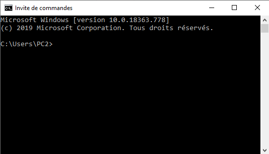

# Méthodologie pour sauvegarder et restaurer la PYBStick26 en version Micropython - Version Windows 10

## Résumé
Avant de basculer sa carte PYBStick26 en programmation Arduino, il est judicieux en amont d'effectuer une sauvegarder du microcontroleur en version micropython afin d'être en mesure de retrouver l'état initial de celui-ci. En effet, le téléversement via Arduino écrase l'ensemble de la flash de la carte.
Cette démarche évite de rencontrer des difficultés de reflash du microcontrôleur à postériori en s'assurant que tous les outils permettant le retour arrière sont fonctionnels.
NB : Les données sauvegardée seront celles de la mémoire flash. Il est conseillé de sauvegarder à part les éventuels fichiers présents sur la carte SD si nécessaire.

## Outils nécessaires
* dfu-util : http://dfu-util.sourceforge.net/releases/

NB : http://dfu-util.sourceforge.net/releases/dfu-util-0.9-win64.zip est la version utilisée dans ce document.

## Installation de dfu-util

Dézipper l'archive téléchargée dans un répertoire. Ex : C:\%userprofile%\Documents\PYBStick26

Ouvrir une invite de commande (CMD) :

:

Taper :
`cd Documents\PYBStick26`

