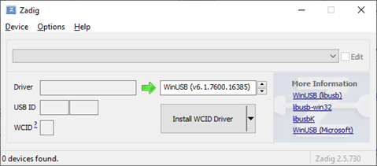

# Méthodologie pour sauvegarder et restaurer la PYBStick26 en version Micropython - Version Windows 10

## Résumé
Avant de basculer sa carte PYBStick26 en programmation Arduino, il est judicieux en amont d'effectuer une sauvegarder du microcontroleur en version micropython afin d'être en mesure de retrouver l'état initial de celui-ci. En effet, le téléversement via Arduino écrase l'ensemble de la flash de la carte.
Cette démarche évite de rencontrer des difficultés de reflash du microcontrôleur à postériori en s'assurant que tous les outils permettant le retour arrière sont fonctionnels.
NB : Les données sauvegardée seront celles de la mémoire flash. Je vous conseille de sauvegarder à part les éventuels fichiers présents sur la carte SD si nécessaire.

## Outils nécessaires
* dfu-util : http://dfu-util.sourceforge.net/releases/

NB : http://dfu-util.sourceforge.net/releases/dfu-util-0.9-win64.zip est la version utilisée dans ce document.

* Optionnel (cas de pb de drivers USB) ZADIG : https://github.com/pbatard/libwdi/releases/download/b730/zadig-2.5.exe

## Démarrage de la carte en mode DFU

Brancher la carte PYBStick26 en maintenant son bouton B (boot 0)
cf. https://github.com/mchobby/pyboard-driver/tree/master/PYBStick#bouton-reset-et-mode-dfu

A ce stade, la carte conserve sa led rouge allumée en continue

## Utilisation de dfu-util

Dézipper l'archive téléchargée dans un répertoire. Ex : C:\%userprofile%\Documents\PYBStick26

Ouvrir une invite de commande (CMD) :

Se déplacer dans le répertoire contenant dfu-util en tapant :
`cd Documents\PYBStick26`

Vérifier que dfu-util accède à la PYBStick via la commande : `dfu-util -l`

Voici les éléments remarquables :
* Found DFU: [0483:df11] : signifie que la puce du fabriquant STMicroelectronics (0483) en mode (df11) Device Firmware Upgrade(DFU) a été détectée
##### NB: Un lien sur les détails d'identifiants : https://devicehunt.com/view/type/usb/vendor/0483/device/DF11
* La flash interne (@Internal Flash) est sur l'altsetting 0 (alt:0) commence à l'adress (0x08000000) et comporte 512k (04*016Kg,01*064Kg,03*128Kg) = 3x128+64+4x16

[/!\ Si vous rencontrez **uniquement** un ou plusieurs messages "Cannot open DFU device XXXX:XXXX"](Restore.md#PB-Driver-USB)

On sauvegarde les 512ko soit (512x1024 = 524 288 octets), via la commande :

`dfu-util --alt 0 --upload pybstick26-original.dfu -s:524288`

A présent un fichier **pybstick26-original.dfu** est présent dans le répertoire où se trouve dfu-util

## dfu-util pour réinstaller une sauvegarde

Comme au paragraphe précédent on vérifie que la carte est bien reconnue via la commande : `dfu-util -l`

Puis on utilise la commande : `dfu-util --device 0483:df11 --alt 0 -s 0x08000000 --download pybstick26-original.dfu`

La PYBStick est revenue à son état initial !

## PB Driver USB

Il est possible bien que la carte soit accessible dans le gestionnaire de périphérique qu'elle ne soit pas visible en mode DFU.
2 cas de figures :
* Débrancher la carte et la rebrancher en mode micropython puis refaire la manipulation de [connexion en DFU](Restore.md#Démarrage-de-la-carte-en-mode-DFU)
* Modifier le driver USB utilisé à l'aide de l'utilitaire ZADIG : https://github.com/pbatard/libwdi/releases/download/b730/zadig-2.5.exe

Etape 1 : Via le menu option/List all devices

Etape 2 : On sélectionne STM32 BOOTLOADER

Etape 3 : On vérifie que le drivers cible est bien WINUSB V6 puis replace driver

Etape 4 : Tout doit être rentré dans l'ordre

## Reinit usine

Il arrive lors de redémarrage de la carte pendant qu'une écriture est en cours que le système de fichier soit corrompu. Votre code sera perdu mais il existe une procédure de remise à zéro - version usine:

Etape 1 : Presser le bouton USER (en bas à gauche port USB vers le haut), puis connecter votre PybStick sur un port USB en maintenant le bouton appuyé.

Etape 2 : Les led orange et verte sur la carte vont se mettre à clignoter alternativement. Relacher le bouton USER lorsque les led verte et orange sont allumées en même temps.

Etape 3 : les led verte et orange clignotent trés rapidement puis les led verte, orange et rouge s'allume en continue et enfin la led rouge s'allume (signe d'écriture sur la carte) et c'est réglé, votre carte est revenue dans sa configuration d'usine.
